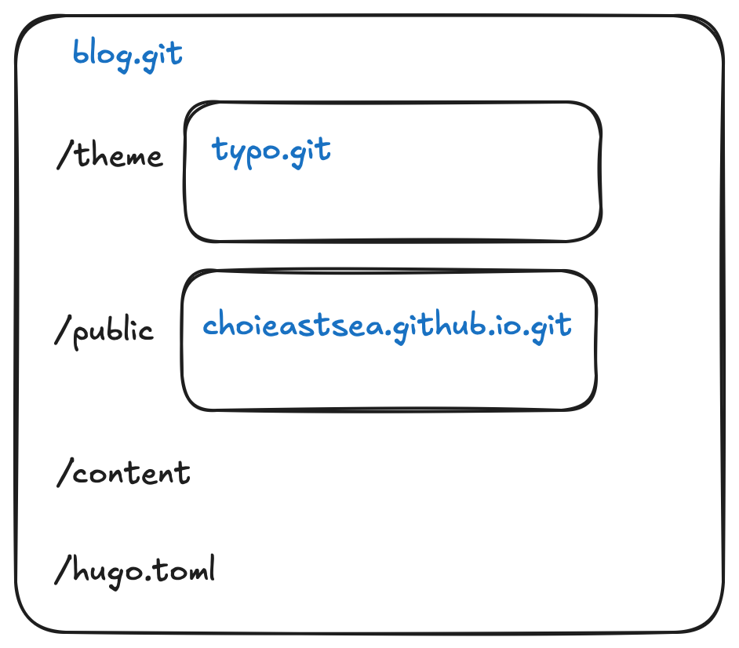
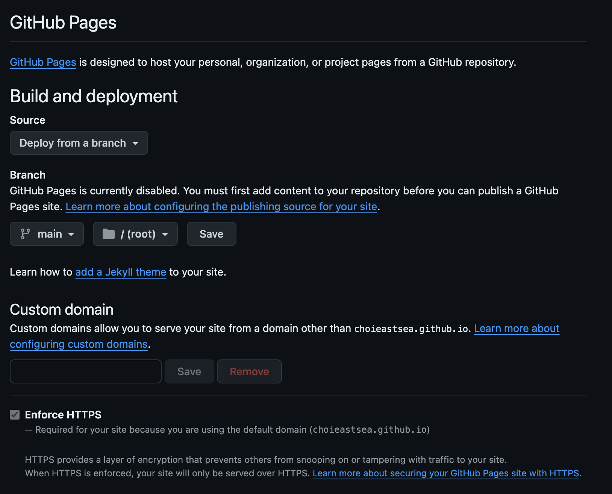

jekyll 블로그는 올드하고 빌드하는게 너무 오래걸렸다. 또한 fork 받아서 사용하다가 `upstream`(원본 저장소)에서 pull 받을 때 충돌이 많이나서 고치다가 포기하는 등 블로그 정체기가 왔다. 이에 대체제를 알아보았고, `hugo`와 `submodule`의 조합으로 다시 블로그를 시작해보려고 한다.


우선 hugo와 submodule에 대해 간단하게 알아보고, 블로그 작성 및 배포 방법에 대해 알아보자.

## hugo?

`go` 기반의 정적 사이트 생성기(static stite generator)이고 오픈소스다. [공식문서](https://gohugo.io)

페이지의 종류(single, list, home, taxonomy 등...)별로 템플릿을 만들고, 문서를 보여줄 때 필요한 다양한 기능을 제공한다. 공식문서를 보고 직접 만들어도 좋지만, 블로그로 사용할 적당한 테마를 이용할 예정이므로 주요 특징과 규칙만 알아보자.

1. 블로그 자체에 대한 설정은 `hugo.toml` 에서 가능하고, 테마별 공식문서에서 제공하는 주요 필드들을 입력한다.
2. 글은 `content/` 디렉토리가 인덱스이고, 이하의 폴더명은 sub url이 된다.
3. 원하는 폴더에 `index.md` 등으로 md 파일을 작성한다. 글의 제목등의 메타데이터는 [front-matter](https://hexo.io/docs/front-matter)로 작성해준다. 보통 yaml 형식으로 작성한다. (yaml의 키값은 테마마다 다를 수 있다)


## submodule

특정 레포지토리에서 다른 레포지토리를 디렉토리로 가져와 사용할 수 있게 git에서 제공하는 기능이다. 쉽게 말해서, 특정 레포지토리의 git스러움을 유지하며 나의 레포지토리의 모듈로 두기 위해 사용하는 기능이다. 

이를 통해 git을 통해 **언어나 프레임워크의 제약이 없는 의존성 관리가 가능하다는 점**이 장점이라고 볼 수 있겠다. 나는 hugo 테마(원본)의 레포지토리, 그리고 블로그가 배포되는 정적파일이 있는 레포지토리 총 <u>2개를 서브모듈로 사용할 예정</u>이다.



content와 toml파일 정도만 관리하고, 배포할 파일은 public/에, 테마와 레이아웃은 theme/에 두면 깔끔해질 것 같다.

## github pages

페이지를 배포하기 위해 여러 방법이 있는데, 나와 같은 블로그를 운영하기에는 호스팅 수준의 웹서버 기능으로 처리가 가능한데, github에서는 `github pages`라는 이름으로 제공한다. 방법이 크게 두가지가 있는 걸로 알고 있는데, 특정 브랜치에 있는 정적파일을 서빙해주거나, 메인 브랜치의 특정 디렉토리에 있는 정적파일을 서빙해주는 것을 선택할 수 있다.

단순히 정적파일이기에 제공해주는 파이프라인을 이용할 수 있다는 점도 장점이라고 볼 수 있다.

또한, `{username}.github.io`라는 이름으로 저장소를 생성하면 해당 domain도 제공해준다.

## 블로그 초기화 과정

### hugo 설치

homebrew로 `brew install hugo` 설치가 가능하다. 모든 운영체제 호환이 가능한 점도 hugo의 장점이라고 한다.

### 작업 레포지토리 생성

위의 그림처럼 `blog`라는 이름으로 저장소를 만들었다. 그리고 `hugo new site` 명령어를 이용하여 구조를 초기화한다. 처음에는 아래와 같을 것이다.

```
.
├── archetypes
├── assets
├── content
├── data
├── default.md
├── hugo.toml
├── i18n
├── layouts
├── static
└── themes
```

### 테마 서브모듈 등록

`git submodule add` 명령어로 `themes/` 디렉토리에 사용하고자 하는 테마를 서브모듈로 pull해온다.

그럼 `.gitmodules`라는 파일이 생기고, 아래처럼 해당 파일에서 의존하고 있는 레포지토리의 정보가 담기게 된다.

```
[submodule "themes/typo"]
	path = themes/typo
	url = https://github.com/tomfran/typo.git
```

또한, 해당 모듈의 버전을 별도로 갖고 있게 된다.

```
diff --git a/themes/typo b/themes/typo
new file mode 160000
index 0000000..9890a04
--- /dev/null
+++ b/themes/typo
@@ -0,0 +1 @@
+Subproject commit 9890a0499034f31c7f84a85ed38d05ae14b42b7f

```

커밋 해시를 기준으로 판단하는 것으로 보인다. 따라서 테마 주인(님)이 해당 저장소에 커밋을 했다면 해당 submodule을 업데이트(`git submodule update`)하면 된다.

push해보면, themes 디렉토리 하위에 `{원본 저장소명} @{커밋해시}`의 꼴로 링크가 생겼음을 확인할 수 있다.

### 로컬 테스트

블로그 루트 디렉토리에서 `hugo serve -D` 로 로컬 라이브 서버를 띄울 수 있다. 실행하면 순식간에 빌드 되고 1313포트에 블로그가 생성된다! `public` 디렉토리에 빌드된 정적파일이 생성된다. 이 디렉토리도 submodule로 사용해야하니 **일단 지워**주도록 하자.

### 배포용 저장소

나의 경우 `choieastsea.github.io` 이름의 저장소가 배포용 저장소이다. 해당 저장소의 루트 디렉토리가 github pages로 배포되도록 저장소에 설정해놓았다. 이렇게 하면 정상적인 정적 파일을 올려놓는다면 알아서 github.io로 서빙될 것이다. (참고로 해당 저장소는 public이여야 한다)



나의 경우, 댓글 기능을 위해 추가로 `gisqus` 앱을 배포 저장소에 설정해주었다. [참고](https://giscus.app/ko)

다시 `blog.git`으로 돌아와, `public` 디렉토리를 배포용 저장소로 설정하자.

`git submodule add https://github.com/choieastsea/choieastsea.github.io.git public`

`git submodule` 명령어를 수행하면 해당 저장소의 서브모듈의 정보를 확인할 수 있다 !

### 배포 레포지토리 생성 및 배포

이제 루트 디렉토리로 돌아와`hugo` 명령어를 수행하면 `public` 디렉토리에 빌드가 된다. 이는 submodule인 배포용 저장소의 변경점이 되고 commit & push를 해주면 배포가 된다!


## 정리

이제 다시 그림을 보면 이해가 쉬울 것이다. 초기 설정만 해놓는다면, 이제는 markdown파일을 작성하고 `hugo` 명령어 수행하여 빌드하고, 배포용 저장소에 push를 하면 된다. md 파일을 따로 보관하고 싶다면 메인 저장소에 푸시를 꾸준히 해놓는 것도 좋을 것이다.

모두 화이팅
