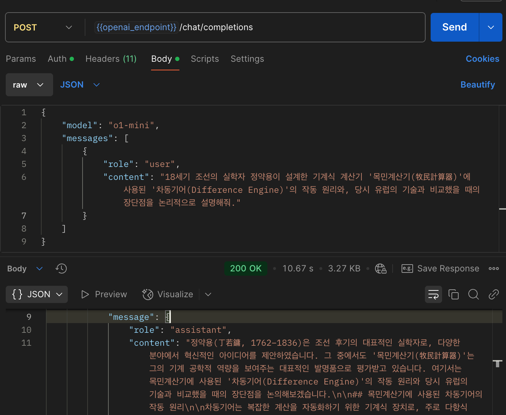

2025년 현재 chatgpt, gemini같은 인공지능 채팅 서비스를 정말 많이 사용하는데, 어떻게 해당 서비스들이 구현되었을까에 대해 알아보고 정리해보았다.

## LLM과 chatgpt는 다르다

LLM(Large Language Model)은 자연어를 입력으로 받았을 때, 가장 적절한 자연어로 출력하도록 학습된 거대 언어 모델이다.

여기서 **학습되었다**는 의미는 가장 자연스러운 문장들의 예시들과 같이 답변하도록 모델 내의 파라미터들이 업데이트되는 과정을 거쳤다고 이해하면 된다.

하지만, LLM이 단순히 문장을 잇는다기엔 chatgpt는 인터넷에서 검색도 해주고, 내가 이전에 했던 말들을 기억했다가 도움을 주고는 한다. 따라서 LLM과 chatgpt(LLM 기반의 AI 서비스) 는 다르다!

| 구분 | LLM 기반의 AI service           | LLM                                        |
| ---- | ------------------------------- | ------------------------------------------ |
| 예시 | chatgpt, claude, gemini, cursor | GPT 4.1, Gemini 2.5 Pro, Claude Sonnet 3.5 |

우리가 사용하는 채팅 서비스 (chatgpt, gemini, claude)들은 LLM의 능력을 활용하여 단순한 문장 완성을 넘어선 기능을 제공하는 것이다.

### LLM을 호출하는 방법

직접 LLM을 구축하거나, `llama`와 같은 오픈소스 LLM을 운영할게 아니라면 일반적으로는 LLM에서 제공해주는 API를 통해 LLM과 소통할 수 있다.

openai의 api [문서](https://platform.openai.com/docs/api-reference/responses/create)를 보면 다음과 같이 response api를 호출할 수 있다.

```shell
> curl --location 'https://api.openai.com/v1/responses' \
--header 'Content-Type: application/json' \
--header 'Authorization: XXXX' \
--data '{
    "model": "gpt-4o",
    "input": "안녕? 내 이름은 바다야"
}'

{
    "id": "resp_id",
    "object": "response",
    "created_at": 1752412722,
    "status": "completed",
    "background": false,
    "error": null,
    "incomplete_details": null,
    "instructions": null,
    "max_output_tokens": null,
    "max_tool_calls": null,
    "model": "gpt-4o-2024-08-06",
    "output": [
        {
            "id": "msg_id",
            "type": "message",
            "status": "completed",
            "content": [
                {
                    "type": "output_text",
                    "annotations": [],
                    "logprobs": [],
                    "text": "안녕, 바다! 만나서 반가워. 오늘 어떻게 지내고 있어?"
                }
            ],
            "role": "assistant"
        }
    ],
    "parallel_tool_calls": true,
    "previous_response_id": null,
    "reasoning": {
        "effort": null,
        "summary": null
    },
    "service_tier": "default",
    "store": true,
    "temperature": 1.0,
    "text": {
        "format": {
            "type": "text"
        }
    },
    "tool_choice": "auto",
    "tools": [],
    "top_logprobs": 0,
    "top_p": 1.0,
    "truncation": "disabled",
    "usage": {
        "input_tokens": 10,
        "input_tokens_details": {
            "cached_tokens": 0
        },
        "output_tokens": 11,
        "output_tokens_details": {
            "reasoning_tokens": 0
        },
        "total_tokens": 21
    },
    "user": null,
    "metadata": {}
}
```

흥미로운 점이 몇가지가 있다.

- 같은 요청을 보내도 다르게 응답이 올 수 있다.
- 다음 요청을 body만 바꿔 "내 이름이 뭐게?" 에 "이름을 알려주지 않았으니 추측할 수 없다" 와 같이 답변한다. **즉 context가 유지되지 않**는다.

context를 유지하기 위해서는 `previous_response_id`에 이전 결과의 id를 실어줘야 한다.

body에 필드를 추가 제공하면 `너의 이름은 바다라고 했잖아! 맞지?` 라고 대답하는 것을 볼 수 있다. 하지만 이는 내부적으로 LLM에게 이전 대화의 맥락을 추가로 전달해주는 것이다. `usage`의 `input_tokens`를 보면 context 없이 보낸 질문에는 13개, context와 함께 보낸 질문에는 44개의 토큰이 소비됨으로 유추할 수 있다.

즉, 이전 대화의 내용을 같이 알려주는 방법으로 LLM은 대화의 컨텍스트가 이어지는 것처럼 보이게 하는 것일 뿐, LLM은 *매우 단순화하면 똑똑한 문장 생성기*라고 보면 된다.

### LLM의 단점

LLM의 알려진 한계/문제점들은 다음과 같다.

1. 학습되지 않은 데이터를 알 수 없다. 최근 정보, 현황과 같은 데이터도 가져올 수 없다.

2. 정확하지 않은 답변을 제공할 수 있다. 현재는 LLM도 튜닝되고 개선되었지만, 이전 모델에는 다음과 같은 말도 안되는 질문에 가장 자연스러운 문장을 이어주는 답변을 해주곤 한다. 이러한 현상을 `hallucination`(환각)이라고 한다.

   

3. **stateless**

   위의 response API 호출의 예시에서, `previous_response_id`를 제공하지 않으면 대화의 컨텍스트가 이어지지 않는다. 컨텍스트를 알려주려면 이전 내용을 추가로 제공해야한다.

## AI Service(agent)가 제공하는 기능들

그렇다면 LLM을 사용한 AI service들은 어떤 식으로 대화가 이어지며, 구글 캘린더에서 내 데이터를 가져올 수 있는 것일까? AI service들은 **LLM의 장점(자율성, 추상적으로 높은 정확도)와 기존 시스템의 장점(명확성, 영속성)을 결합하여 만든 시스템이라고 볼 수 있다**.

### prompting

사용자 요청은 그대로 LLM으로 들어가지 않는다. 입력으로부터 사용자의 의도를 파악하고, 이에 맞게 질문을 수정한다.

### stateful한 응답

사용자의 context를 유지하기 위해 프롬프트에 기억된 정보들을 추가한다.

### 외부 tool 호출/데이터 탐색

만약 tools이 있다면, tool을 호출할 수 있는 인터페이스를 제공한다. 정보를 외부로부터 가져올 수도 있다.

또한 `MCP`(Model Context Protocol) 서버도 포함되어 있을 수 있다.

### 반복

**위의 모든 과정에서 LLM을 호출할 수도 있다**. 결국 LLM에 입력될 하나의 프롬프트를 만들고 답변을 평가한다. 답변의 평가 수준이 정해져 있다면 이를 만족할 때까지(혹은 loop count가 한도에 다다를 때 까지) prompt를 보완하는 등의 작업을 거쳐 답변한다.

### 참고: workflow와 agent의 구분

따라서 개발자는 LLM을 활용하여 자연어로 들어온 명령을 처리하기 위해 여러 컴포넌트들을 조합하고 또 그 과정에서 LLM을 사용할 수 있도록 구성/구현 하면 된다. 참고로, worflow와 agent는 구분되는데, langgraph라는 AI 오픈소스 프레임워크에서는 이를 이렇게 표현하고 있다.

>  Workflows are systems where LLMs and tools are orchestrated through predefined code paths. Agents, on the other hand, are systems where LLMs dynamically direct their own processes and tool usage, maintaining control over how they accomplish tasks.

즉, workflow는 정의한 흐름대로만 진행하고, agent는 동적으로 계획/판단하고 반복하여 목표를 달성하는 것이라고 한다. 이러한 agent는 발전되어 위의 정의한 agent의 모든 과정에서 LLM을 호출하여 행동을 결정하는 `ReAct(Reasoning + Acting) agent`로 나아간다.


[출처](https://x.com/bindureddy/status/1874568118439461254)

### 관련 프레임워크

이러한 AI agent를 구현하기 위해서는 보통 잘 알려진 프레임워크를 사용하면 되는데, 다음과 같은 것들이 존재한다.

- LangChain - LangGraph
- HuggingFace - smolagents
- llama- llama-amgent
- OpenAI - swarm
- CrewAI
- Pydantic AI

이러한 framework들에는 *LLM agnostic한 agent과 multi agent를 위한 인터페이스가* 정의되어있다. 아직까지는 표준화되었다기보다는 표준화의 리더가 되기 위한 춘추 전국 시대라고 봐도 좋을 것 같다. 나는 현재 가장 많은 사람들이 사용하고 있는 langgraph라는 프레임워크로 한번 에이전트를 구현해보려고 한다.

끝!