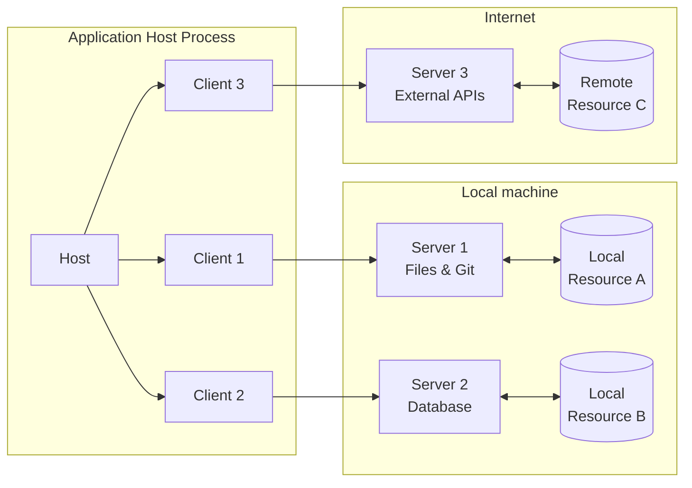
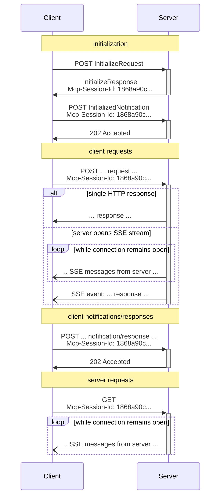
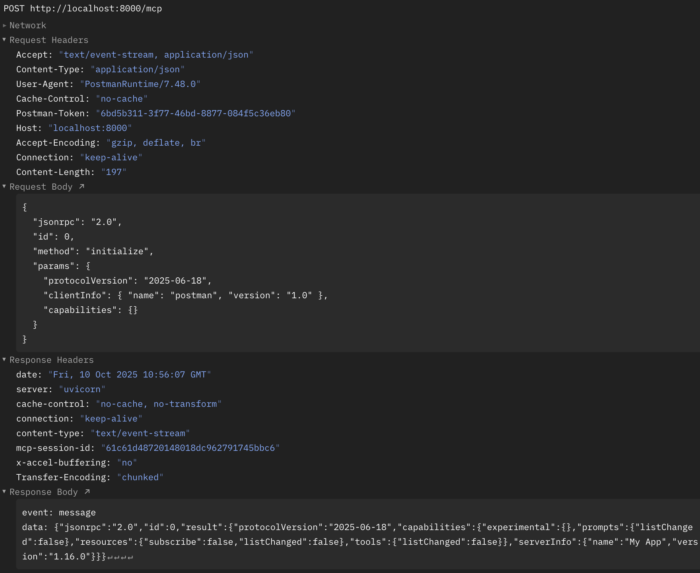
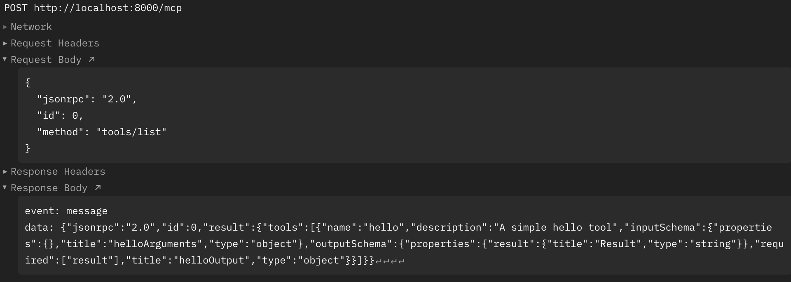

최근 MCP 서버를 만드는 [프로젝트](https://github.com/openstack-kr/python-openstackmcp-server)를 진행하고 있는데, python mcp sdk인 `fastmcp`를 이용하여 개발하였다. sdk를 활용하니 간단하게 구현이 가능하지만, *fastmcp가 의존하고 있는 인터페이스인 mcp 스펙*에 대해 궁금증이 생겼다.

오늘은 mcp의 사례와 구현 방법보다는 **구체적으로 mcp의 스펙**에 대해 알아보고, **컴포넌트끼리 어떻게 의사소통**하는지에 초점을 맞춰보고자 한다.

이 글은 [현재 기준 최신 버전의 스펙]((https://modelcontextprotocol.io/specification/2025-06-18))을 참고하여 작성되었다.

## 개요

`MCP`(model context protocol)는 LLM의 한계(한정적인 정보와 context)를 극복하고, 나아가 llm과 상호작용할 수 있는 어플리케이션을 위해 만들어진 표준화된 프로토콜이다.


## 아키텍쳐

MCP는 **client-server 모델**을 따르고, 다음과 같이 3개의 주요 컴포넌트로 구성된다.


- Host : 클라이언트를 관리하고, **llm 모델을 통합**하여 실행하는 application
- Client : 호스트에 의해 생성되어, **MCP server에 대응되어 연결을 관리**하고, 호출한다. 
- Server : 특수한 context와 **기능들을 제공**한다. 로컬 혹은 원격에서 실행될 수 있다. 기능으로는 **tool, prompt, resource**를 제공할 수 있다.

이를 우리가 사용하는 사례에 대입해보면 이해가 쉬울 것이다.

- Host : claude desktop
- Client : claude desktop 내부 어딘가에 구현된 mcp client
- Server : mcp server (`claude_desktop_config.json`에 실행 방법이 정의되어 있음)


## Protocol

Host는 MCP를 활용하기 위한 컴포넌트이며, mcp server와 client 컴포넌트는 다음의 스펙을 준수해야한다.

### message

`message`는 컴포넌트간 상호작용할 때의 내용에 대한 것으로 크게 요청-응답 방식과 notifications 방식이 있다.

모든 메시지는 UTF-8로 인코딩된 `JSON-RPC 2.0`을 준수해야한다.

1. request-response

   요청-응답의 구조는 client와 server가 **동기적인 상호작용**을 수행할 때 필요한 메커니즘이다. 일반적인 tool 호출등이 이에 해당한다.

   request는 다음의 형식으로 전달되어야 한다.

    ```json
    {
    jsonrpc: "2.0";
    id: string | number;
    method: string;
    params?: {
        [key: string]: unknown;
    };
    }
    ```
    response는 다음과 같이 제공되어야 한다.

    ```json
    {
    jsonrpc: "2.0";
    id: string | number;
    result?: {
        [key: string]: unknown;
    }
    error?: {
        code: number;
        message: string;
        data?: unknown;
    }
    }
    ```

2. notifications
    notifications는 receiver가 응답하지 않는 **비동기적인 상호작용**을 수행할 때 사용된다. 컴포넌트에서 발생한 여러 이벤트들을 전달할 때 사용한다.

    다음과 같이 전달되어야 한다.
    ```json
    {
    jsonrpc: "2.0";
    method: string;
    params?: {
        [key: string]: unknown;
    };
    }
    ```

    **id가 포함되면 안된다**는 것을 유의하자.

### transports

client-server 통신에서 지원되는 통신방식은 보통 표준 입출력인 `stdio`과 `streamable-http`가 있다.

#### stdio

stdio로 통신하는 경우, client는 mcp server를 **sub process**로 실행한다. 이후, mcp server는 표준 입력(stdin)으로 `JSON-RPC` 메시지를 읽고 처리하여, 표준 출력(stdout)으로 메시지를 보낸다.

주의할 점으로는 stdio를 선택한 경우, mcp server의 메시지가 아닌 `print` 문 같은 경우에는 client에 영향을 줄 수 있으니 포함하면 안된다. 따라서 로그는 별도로 남기거나, client에게 log 형식을 맞춰 전달해야 한다.


#### streamable-http

mcp server를 **독립적인 서버 프로세스로 실행**하고, 여러 client에 대해 **HTTP 요청**을 받아 처리하도록 한다. mcp server는 SSE로 여러 메시지들을 스트리밍할 수도 있다. 각 메시지는 역시 JSON-RPC 형식으로 제공되어야 한다.

이 경우, server는 `/mcp`와 같은 단일 endpoint(`mcp endpoint`라고 함)를 통해 GET, POST 메서드를 지원하도록 제공해야 한다.

##### 주요 http headers

MCP는 server-client의 stateful한 연결을 지원하기 위해 `Mcp-Session-Id` http header를 제공할 수 있고, 제공되는 경우 이후 요청에서 이를 포함해야 한다. 

또한, 클라이언트는 `MCP-Protocol-Version` 헤더를 포함해야 서버가 해당 프로토콜 버전에 맞는 응답을 할 수 있다. 유효하지 않은 버전이라면 server는 400 코드를 응답한다.

`streamable-http`를 통신방식으로 채택한 경우의 흐름은 다음과 같다. stateful session을 제공하기 위한 `initialization` 단계가 포함된다.



## postman으로 streamable-http 통신 테스트

위의 sequence diagram을 참고하여, `fastmcp`로 구현한 mcp server의 작업을 `streamable-http`로 통신하는 과정을 postman으로 실행해보자. postman이 mcp client로 동작하도록 해당 스펙을 준수하여 요청을 보내도록 한다. 

mcp server 코드는 다음과 같다.

```python
from mcp.server.fastmcp import FastMCP

# Create MCP server
mcp = FastMCP("My App")


@mcp.tool()
def hello() -> str:
    """A simple hello tool"""
    return "Hello from MCP!"

if __name__ == "__main__":
    mcp.run(transport="streamable-http")
```

1. initialization

    initialization 단계는 client와 server의 첫번째 동작으로, 이 단계에서는 mcp version, capability, 각자의 정보에 대해 교환하고 session id를 발급한다. 

    `capability negotiation`은 optional feature에 대한 지원 여부를 포함한다. 예를 들어, mcp server의 tool, prompt, resource가 변경되었을 때 notifications를 발행하는지 여부가 initialization 단계에서 공유된다.

    body의 json-rpc 형식은 [해당 문서](https://modelcontextprotocol.io/specification/2025-06-18/basic/lifecycle#initialization)를 참고하였다.

    `fastmcp`는 기본적으로 python asgi server로 실행되며, mcp endpoint는 기본적으로 `/mcp`이다. postman으로 해당 엔드포인트에 `POST`요청으로 `initialize`를 수행한다.

    
    client는 `Accept` 헤더에 text/event-stream, application/json를 모두 포함하고, json-rpc 형식으로 `initialize`를 호출해야 한다. server는 이에 sse 형식으로 응답하고, 단일 메시지를 포함한 청크를 응답한다. 응답 헤더에는 `mcp-session-id`로 세션 id가 서버측에서 발급된다. 

    

    session id를 발급받았다면 client측에서 server로 `initialized`를 호출해야한다. header에는 발급받은 `mcp-session-id`를 포함해야 한다.

    ```json
    {
    "jsonrpc": "2.0",
    "method": "notifications/initialized"
    }
    ```
    initialized는 message가 아닌 notifications로, `202 Accpeted`가 온다면 이제 동작들을 수행할 수 있다. 이제 요청을 보내보자.

2. operation: `tool/list`

    mcp server의 tool list를 알고 싶은 경우, 다음의 body로 호출하도록 한다.

    ```json
    {
    "jsonrpc": "2.0",
    "id": 0,
    "method": "tools/list"
    }
    ```

    역시 session 정보를 포함하여, 같은 endpoint로 호출하면 아래와 같은 응답을 확인할 수 있다.
    

    list 응답은 cursor 기반 pagination이 제공된다. 주의할 점으로는, initialized 되지 않았다면 요청이 허용되지 않을 것이다. 

    response를 보면, `hello`라는 tool이 존재함을 알 수 있다. 이를 통해 client는 해당 tool을 호출해볼 수 있다. hello tool의 경우 인자가 없으니 params 내에 `arguments`를 주진 않았다.

3. operation: `tool/calls`
    ```json
    {
    "jsonrpc": "2.0",
    "id": 0,
    "method": "tools/call",
    "params": {
        "name" : "hello"
    }
    }
    ```
    이를 body에 포함하여 요청을 보내면 아래와 같은 응답이 온다.

    ```json
    {
        "jsonrpc": "2.0",
        "id": 0,
        "result": {
            "content": [
                {
                    "type": "text",
                    "text": "Hello from MCP!"
                }
            ],
            "structuredContent": {
                "result": "Hello from MCP!"
            },
            "isError": false
        }
    }
    ```

    위 tool에서 의도한 응답 문자열이 **jsonrpc 형식으로 변환**되어 응답이 왔음을 확인할 수 있다.

이렇게 mcp server의 결과를 client가 받아서 host에게 전달할 수 있다. host는 llm input context에 이를 포함할 것이다.

### 정리

mcp spec을 보며, 직접 `streamable-http` 통신에서 어떻게 server와 client가 상호작용하는지를 확인해보았다. mcp를 이용하면 <u>llm을 통합한 host가 client를 이용하여 server를 호출하여 llm의 context에 도움을 줄 것</u>이다.

이러한 mcp client는 `fastmcp`와 같은 mcp toolkit으로 간단하게 작성이 가능하며, `claude desktop`과 같은 application들에는 mcp client가 포함되어 configuration 수준으로 간단하게 연결이 가능하다.

오늘은 server와 client가 어떻게 상호작용하여 도구들을 제공하고 실행하는지에 대해 간단하게 알아보았다. 실제 remote mcp server를 운영할 계획이라면 multi client에 따른 보안 처리 등도 적용할 수 있어야 하니, 사용하는 sdk의 기능들을 활용하도록 하자.

끝!
