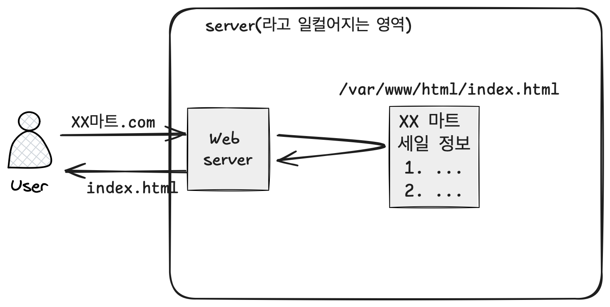
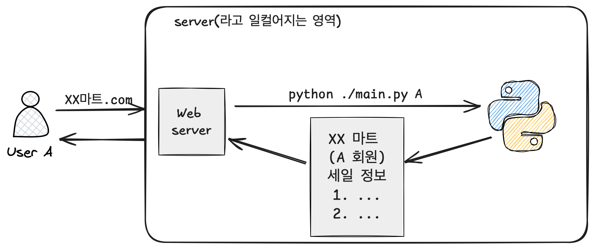
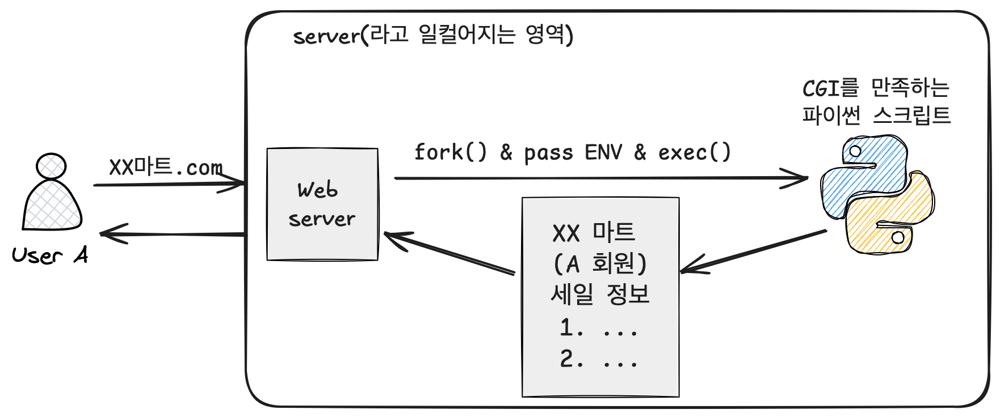

우리가 작성한 어플리케이션(혹은 code/script)은 어떻게 HTTP 요청에 응답할 수 있을까?

오늘은 웹 서버와 웹 어플리케이션을 구분짓고, 그 과정을 알아보려고 한다.


## 웹 서버

클라이언트의 요청에 대하여 적절한 응답을 하는 소프트웨어라고 볼 수 있다.

예를 들어, 마트에서 전단지 비용이 아까워 웹으로 전단지를 볼 수 있게 해놨다고 가정해보자. 그 경우, 웹서버는 요청시 정적인(static) 파일들을 내려주면 될 것이다.



사용자는 `index.html`을 적절히 해석해서 보여줄 수 있는 `웹 브라우저`로 해당 파일을 읽을 수 있게 된다.

이러한 요청은 HTTP 기반으로 이루어지므로, 웹서버는 <u>HTTP 요청을 받아 HTTP 응답을 해주는 소프트웨어</u>라고 생각해볼 수 있겠다.

그리고 위의 예시에서는 요청에 대해 특정 위치의 파일만 제공하였으므로 `static web server`라고 한다.

## 동적인 서버

세일 정보가 매일 바뀐다고 해보자. 사장은 서버 컴퓨터에 접근해서 매일 index.html 파일을 수정하도록 할 수 있다. 귀찮더라도 여기까지는 가능하다.

근데 사장은 갑자기 *회원 등급에 따라 다른 세일 정보를 보여주고 싶어졌다*. <u>사용자마다 요청에 대해 다른 응답이 필요</u>해지는 것이다. 기존 방식으로는 해결하기 어려워졌고, **동적인 서버가 등장**하게 된다. (여기서부터가 백엔드 개발자의 본격적인 영역이라고 생각한다)

파이썬 스크립트로는 해당 비즈니스 로직을 해결할 무언가가 준비 되어있다고 가정하자. 아래처럼!

```python
# main.py
import sys

def get_index(user):
  user_info = get_user_info(user)
  sales_info = get_sales_info(user_info.class)
  html = create_html(sales_info)
  return html

if __name__ == "__main__":
  get_index(sys.argv[0])
```

해당 코드는 요청이 들어올 때,` python main {회원정보}`로 실행할 수 있을 것이다.

그럼 동적인 웹서버는 다음과 같이 동작해야 할 것이다.



웹서버는 `xx마트.com`으로 들어온 요청에 대해 현재 디렉토리에 위치한 `main.py`를 인자를 넘겨주며 실행하면 된다. 이렇게 회원별로 다른 페이지를 보여줄 수 있을 것이다.

## CGI (1997)

이렇게 어찌저찌 해결은 된 것 같은데, **웹 서버가 특정 코드(여기서는 파이썬)에 종속된다는 문제점**이 생긴다. 이말은 즉, 언어가 달라지거나 전달 내용(사용자 정보에 추가로 뭘 준다던지)이 달라질 때마다 **웹 서버를 뜯어 고쳐야한다는 점**이다.

이에 **언어에 독립적인 웹 서버와 어플리케이션 간 규약**이 만들어질 필요가 있었고, `CGI`(Common Gateway Interface)가 정의되었다.

이제 요청이 들어왔을 때, 웹 서버는 CGI 형식을 만족하는 프로그램을 실행하면 되고 이는 *인터페이스에 의존해야한다는 OOP 설계 원칙에도 부합*해보인다.



웹서버 입장에서 다음과 같은 일들이 일어난다.

1. HTTP 요청 수신

2. CGI 스크립트 요청 확인

   동적인 컨텐츠가 아니라면 그냥 정적인 컨텐츠를 제공한다.

3. 프로세스 생성 (fork) 

   CGI스크립트를 실행하기 위해 웹서버는 **새로운 프로세스를 생성**한다. 

4. 환경변수 설정

   CGI 스크립트에 전달되어야 할 환경변수(url, http method, 쿼리, header 등)를 해당 프로세스의 환경변수로 설정한다.

5. CGI 스크립트 실행 & 결과 응답

   포크된 프로세스에서 스크립트를 실행하고, 웹서버에서 이의 결과를 HTTP 형식으로 응답한다.

참고로 위의 그림 예시에서 표현한 것과는 달리, 최초의 CGI는 html form의 action을 처리하기위해 사용되었다고 한다. (최근에는 form 말고도 많은 http 요청이 오고간다)

### CGI Environment variables

[해당 사이트](https://www6.uniovi.es/~antonio/ncsa_httpd/cgi/env.html)에는 웹서버가 CGI 스크립트에 전달할 수 있는 환경변수가 정의되어 있으니 참고한다. 

### CGI의 문제

CGI에는 항상 새로운 프로세스를 생성해서 스크립트를 실행해야 한다는 문제점이 있다. 웹서버는 요청시마다 `fork()` 시스템 콜로 요청을 처리하는데 이 시간은 불필요하다. 이에 prefork해놓거나, 한 프로세스에서 처리할 수 있는 방법들이 고안되었다. (fastcgi 등)


## 정리

요약하면, **웹 서버는 요청에 대한 동적인 응답을 하기 위해 CGI와 같은 인터페이스를 정의하였고, 각 언어는 그 인터페이스 기반의 웹 프레임워크를 만들었다**고 볼 수 있다. 

하지만, CGI는 웹서버가 요청에 대해 프로세스를 생성하는 방식으로 인하여 현재 사용하지는 않고, 각 진영에서 알맞은 인터페이스(wsgi, servlet)를 정의하여 사용하고 있다.

다음 시간에는 각 진영별로 사용하는 인터페이스와 그 구현체에 대해 공부해보자.

화아팅!