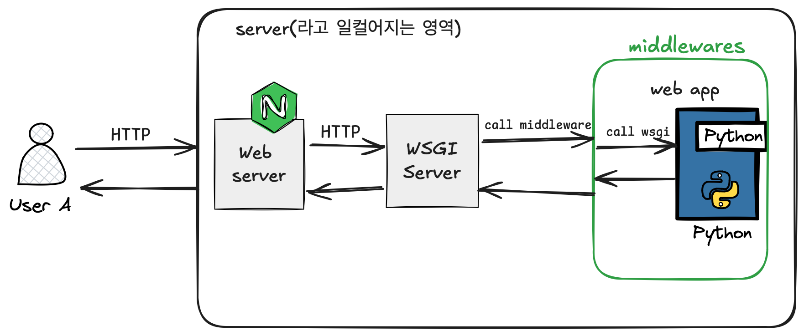
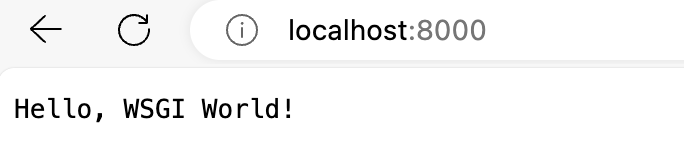

[이전 글](https://choieastsea.github.io/posts/4)에는 웹서버와 어플리케이션을 구분하고, 이를 연결해주는 인터페이스/표준에 대해 알아보았다. 오늘은 그중 파이썬 진영의 표준인 `WSGI`에 대해 알아보자.

# PEP333(3)

[PEP333](https://peps.python.org/pep-0333/)에서는 파이썬을 위한 Web Server Gate Interface, 즉 WSGI를 제안하였고, [PEP3333](https://peps.python.org/pep-3333)에서는 python3 호환 WSGI를 제안하였다. 오늘은 3333를 읽어보자.

## PEP333의 목표

PEP333의 서문에서는 Java에서 servlet api를 지원하는 웹 어플리케이션을 만들면, servlet 호환 가능한 여러 종류의 web server로 실행이 가능하다는 것을 예시로 시작한다. 이처럼 파이썬에도 간단한 웹 인터페이스의 표준을 제안하였는데, 그것이 바로 WSGI이다. 

`WSGI`는 부가적인 기능을 정의하지는 않는데, 이는 기존 프레임워크와의 호환성이 더 중요하기 때문이라고 한다. 이로써 알 수 있는 것은 웹 프레임워크와 웹 서버는 이미 존재하며, *그 둘을 잇는 표준을 만드는 것이 목표에 가까움*을 알 수 있다.

## 핵심 개념

WSGI 인터페이스를 인지하고 준수해야 하는 곳은 2군데가 있다. 

1. 앱 or 프레임워크

   WSGI application은 단순히 2개의 인자(environ, start_response)를 받는 `callable object`이다. 이 callable한 녀석은 여러 번 실행될 수 있어야 한다.

2. 웹 서버 or 게이트웨이

   HTTP 클라이언트로부터 요청이 오면 위에서 만든 callable WSGI app을 호출한다.

### middleware

2개의 주요 컴포넌트 외에 추가로, `middleware`라는 개념이 있다. WSGI app을 감싸서 리턴하는 형태로 구현되어(재귀적으로 존재 가능) WSGI 앱과 서버 사이를 연결해준다. 앱을 감싸서 기능을 추가하여 또 다른 앱을 리턴해준다고 생각해도 좋다!

일반적으로 사용되는 곳으로는 요청과 응답을 로깅하는 등에 사용할 수 있다. application과는 독립적이면서도 횡단의 관심사를 수행하도록 설계하기도 한다. **decorator 패턴과 유사**하다.

`middleware`를 포함한 일반적인 python web service의 구성도는 다음과 같다.



1. `nginx`웹서버가 HTTP요청을 받아, **WSGI 서버(gunicorn)를 HTTP 호출**한다.

   WSGI web server는 독립적인 HTTP 서버로 동작할 수 있다. 하지만, 일반적으로 정적파일 혹은 대용량 요청에 대한 처리 능력보다는 **python 스크립트 실행에 초점**이 맞춰져있기에 보통은 앞에 nginx나 apache같은 <u>범용 웹서버가 wsgi web server를 호출하는 방식으로 구성</u>되어 있다.

2. WSGI 서버는 app을 포함한 middleware를 호출한다.

3. middleware는 미들웨어 로직을 app 전후로 수행한다. (middleware는 여러개가 있을 수 있다)

4. 응답한다.

## WSGI 서버 구현해보기

이제 간단한 WSGI 서버를 만들며 사양을 익혀보자. 

### WSGI 호환 application 만들기

위의 그림에서 web app에 해당하는 부분을 만들어보자.

class 기반으로 만들수도 있지만, 간단하게 함수 기반 app을 만들어 보았다.

```python
# app.py
def my_app(environ, start_response):
    """WSGI 애플리케이션 예시"""
    status = "200 OK"
    headers = [("Content-Type", "text/plain")]
    start_response(status, headers)
    return [b"Hello, WSGI World!"]
```

WSGI app은 인자를 2개 받는다.

- `environ` : CGI에서는 요청 정보(path, method, header, body 등)를 전달하기 위해 환경변수를 설정한 프로세스를 실행했지만, **WSGI에서는 dictionary 형태로 요청 정보가 전달**된다. 이로써 CGI를 파이썬의 방식대로 사용할 수 있게 된다.
- `start_response` : callable 함수이다. 해당 함수는 wsgi 서버에서 구현되어 있어야 한다.

HTTP content type에 맞게 결과를 알맞게 전송하면 된다.

만약 WAS에서의 controller/router에 해당하는 역할이 필요하다면, app에서 처리할 수 있다. environ에서 넘어오는 path나 request body등의 정보를 통해 분기하여 응답하면 된다.

#### WSGI app를 서버와 연결하기

WSGI 웹 서버중 하나인 `gunicorn`을 이용하여 위의 my_app를 서버로 사용해보자. 우선 `pip install gunicorn` 등으로 gunicorn을 설치한 환경에서, 아래 명령어를 실행한다.

```shell
> gunicorn app:my_app
[2024-08-25 10:55:31 +0900] [14954] [INFO] Starting gunicorn 21.2.0
[2024-08-25 10:55:31 +0900] [14954] [INFO] Listening at: http://127.0.0.1:8000 (14954)
[2024-08-25 10:55:31 +0900] [14954] [INFO] Using worker: sync
[2024-08-25 10:55:31 +0900] [14955] [INFO] Booting worker with pid: 14955
```

그리고 8000번 포트에 접근하면 우리가 만든 my_app이 실행되는 것을 볼 수 있다.



이렇듯 `WSGI`를 준수하여 어플리케이션을 구현하면 별도의 종속성 없이 웹 서비스를 서빙할 수 있다.


### WSGI server 만들기

`gunicorn`을 이용하지 않고, wsgi web server를 직접 만드는 것도 가능하다. 특정 포트에 소켓을 열고, 응답하면 된다.

```python
# main.py
def run_wsgi_server(application, host="127.0.0.1", port=8000):
    """간단한 WSGI 서버 구현"""
    # 소켓 생성 및 바인딩
    with socket.socket(
        socket.AF_INET, socket.SOCK_STREAM
    ) as server_socket:  # TCP기반 IPv4 소켓 객체 생성
        server_socket.setsockopt(socket.SOL_SOCKET, socket.SO_REUSEADDR, 1)
        server_socket.bind((host, port))
        server_socket.listen(1)  # 최대 동시 연결 수
        print(f"Serving on http://{host}:{port} ...")

        while True:
            # 클라이언트 요청 수신할 때까지 block
            client_socket, client_address = server_socket.accept()
            with client_socket:
                # 요청 로그
                print(f"request from {client_address}") 
                request = client_socket.recv(1024).decode("utf-8")
                if not request:
                    continue

                # 환경 변수 설정 (app을 call할 때 인자로 전달)
                environ = {
                    "REQUEST_METHOD": "GET",  # 단순화하여 GET 요청만 처리
                    "PATH_INFO": "/",
                    "SERVER_NAME": host,
                    "SERVER_PORT": str(port),
                }

                # 응답 함수 (app을 call할 때 인자로 전달)
                def start_response(status, response_headers):
                    # HTTP 문자열 만들어서 전송
                    client_socket.sendall(f"HTTP/1.1 {status}\r\n".encode("utf-8"))
                    for header in response_headers:
                        client_socket.sendall(
                            f"{header[0]}: {header[1]}\r\n".encode("utf-8")
                        )
                    client_socket.sendall(b"\r\n")

                # WSGI 애플리케이션 호출 및 응답 전송
                response_body = application(environ, start_response)
                for data in response_body:
                    client_socket.sendall(data)


if __name__ == "__main__":
  	from app import my_app
    run_wsgi_server(my_app)

```

이를 실행해보자!

```shell
> python main.py
Serving on http://127.0.0.1:8000 ...
request from ('127.0.0.1', 51012) # 요청 로그
```

요청~응답이 잘 동작하는 것을 확인할 수 있다.

#### multi thread/process server

보통 서버에 요청이 들어오면, 한 요청을 처리하는 하나의 스레드를 두어 처리하고는 한다. 방금 우리가 알아본 구조에서는 어떤 곳에서 이를 처리할까?

일반적으로는 **WSGI server에서 처리**하도록 한다. 요청이 들어오기 전에 스레드 풀을 만들거나, 멀티 프로세스로 WSGI 서버와 앱을 메모리에 올려놓고, 여러 요청이 들어왔을 때 담당 스레드/프로세스에서 요청을 처리하도록 한다. wsgi app을 미리 실행해놓는 이유는 요청이 들어온 시점에 disk에 저장된 코드를 실행하면 시간이 오래 걸리기 때문이다. 

하지만 python은 `GIL`의 존재하여 `CPU bound`한 작업은 multi-thread server로 구성하지 않고 multi-process server로 구성하는 것이 동시성 성능에 좋은 것으로 알려져 있다. (물론 IO bound의 경우에는 multi thread의 효과를 볼 수 있다) 이러한 이슈는 GIL를 interpreter당 가져가도록 개선될 예정이라고 했던 것 같으니 참고만 하자..

### middleware

간단한 로깅을 위한 미들웨어도 만들어보자.

```python
def create_app(app):
    def middleware(environ, start_response):
        # 요청 URI를 로깅
        print(f"<Request URI>: {environ['PATH_INFO']}")
        # 애플리케이션 호출
        response = app(environ, start_response)
        # 응답 데이터를 로깅
        print(f"<Response data>: {app(environ, start_response)}")
        return response

    return middleware
```

WSGI에서는 middleware를 감싼 앱을 실행하면 된다.

```python
# main.py
run_wsgi_server(create_app(my_app))
```

이를 실행해보자.

```shell
> python main.py
Serving on http://127.0.0.1:8000 ...
request from ('127.0.0.1', 56842)	# web server에서 출력
<Request URI>: /	# middleware 출력
<Response data>: [b'Hello, WSGI World!'] # middleware 출력
```

순수 파이썬으로 서버를 만들어버린 것이다 ~!


## 정리

WSGI 인터페이스를 준수하는 웹 서버를 만들어 보았고 각각의 역할은 다음과 같다.

- WSGI app : 라우팅, 어플리케이션 로직 담당
- middleware : 앱을 감싸는 데코레이터 역할
- WSGI server: 클라이언트 요청을 받아 WSGI app에 적절한 인자로 실행하고, 응답하는 역할

보통 python 웹 생태계는 WSGI app과 middleware 역할을 하는 부분이 `django`, `fastapi`와 같은 웹 프레임워크로 추상화되어있다. WSGI server는 복잡한 비즈니스 로직보다는 stability과 scalability에 신경을 쓰므로 `gunicorn`, `uwsgi`와 같은 안정적인 라이브러리를 사용한다.


파이썬 웹 개발을 한다면, `웹 프레임워크 선택(+ orm 라이브러리 선택) → WSGI 웹 서버 선택 → 범용 웹 서버 선택`의 과정에서 각 요소들을 독립적으로 선택할 수 있듯, 상당히 `loosely coopled` 되도록 설계되어있다는 사실을 엿볼 수 있다.


### 비동기 서버 interface (ASGI)

IO bound한 요청이 많은 현대의 웹 서비스에서 multi-thread로 요청을 처리하는 것은 동시성 성능이 떨어진다. 이에 이벤트 루프를 사용하여 싱글 스레드 환경에서 비동기적으로 요청을 처리하는 비동기 서버가 나오게 되었다. 파이썬에서도 이를 지원하기 위해 WSGI의 확장판인 [ASGI](https://asgi.readthedocs.io/en/latest/), (Asynchronous Server Gateway Interface)가 존재한다.

ASGI 서버는 언젠가 시간이 되면 만들어보도록 하자 !


화이팅 ~


### 참고

https://www.youtube.com/watch?v=WqrCnVAkLIo

https://peps.python.org/pep-3333

https://peps.python.org/pep-0333


