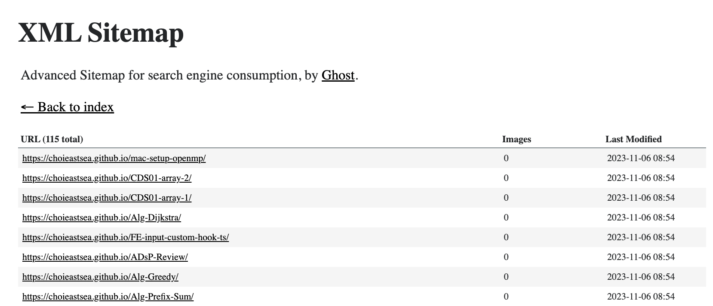

리액트js를 사용한 경험에 대해 이야기를 나누다가 SPA의 장단점에 대한 이야기가 나왔는데, 다시 한번 공부해보며 개념을 정리하고자 한다.

# SPA란

우선, `SPA`는 Single Page Application의 줄임말로, 웹 서비스에서 하나의 페이지로 서비스를 제공하는 형태의 어플리케이션이다. 

많은 웹사이트들이 SPA 기반으로 만들어져있다고는 하지만, url이 바뀌는 것으로 보아 페이지가 하나만 존재하지는 않은 것 같다. 하지만, 이는 브라우저(client)에서 주소를 처리하는 `history api`를 이용하기에 그렇다.

## history api 와 client side routing

기본적으로 browser url 탭에 주소를 입력하면, 해당 url에 매칭되는 물리 서버로 요청을 보낸다. 이는 외부 어딘가에 존재하는 서버에게서 데이터를 받아오게 된다.

하지만, SPA framework에서는 *서버로 요청을 보내지 않고 routing을 클라이언트에서 처리*하는데 이를 `client side routing`이라고 한다. url이 바뀌어 브라우저가 서버로 요청을 보내는 것이 아닌, `history api`를 이용하여 **주소만 바꾸고 이에 맞게 컨텐츠를 재구성하는 것**이다!

간단하게 history api에 대하여 알아보자. `window.history`로 접근할 수 있는 History객체는 

`pushState`함수를 이용하여 현재 브라우저 탭의 url을 바꿀 수 있다. 또한, 이는 페이지가 이동한 것처럼 뒤로가기에 기존 페이지를 넣을 것이다. (stack과 유사한 구조)

`history.pushState({data : 'data'}, null, '/login')`를 통하여 url을 /login으로 바꾸고, 해당 페이지로 data 객체를 넣어줄 수 있다. 두번째 인자는 page title을 의미한다.

이 외에도 `history.replaceState()`와 같이 기존 history stack을 지우고, 현재 인자의 값으로 대체하는 함수가 있다.

[history api MDN](https://developer.mozilla.org/ko/docs/Web/API/History_API)

react에서는 `react router dom`과 같은 라이브러리에서 이를 기반으로 **server가 아닌 client side에서 url을 바꿔주어 UI를 변경하도록 한다**. 또한, 이에 대한 핸들러를 도입하여 각 url마다 다른 UI를 보여주도록 구현되어있을 것이다. 이에 웹서버로 해당 페이지에 대한 리소스를 요청하지 않아도 되니, **끊김없는 페이지 이동**을 경험할 수 있다. 우리가 react에서 routing을 할 때, `a tag`가 아닌 `Link`와 같은 컴포넌트를 사용하는 이유도 history api 기반으로 사용하기에 그렇다는 것을 유추해볼 수 있다!

웹서버는 라우팅에 대한 처리를 하지 않고, 단순히 build된 정적인 파일을 제공해주기만 하면 될 것이다.

웹 서버를 위한 express.js의 예시 코드이다.

```javascript
const express = require('express');
const path = require('path');
const app = express();

// 정적 파일 서빙
app.use(express.static(path.join(__dirname, 'build')));

// 요청에 대하여 index.html을 리턴
app.get('/', (req, res) => {
  res.sendFile(path.join(__dirname, 'build', 'index.html'));
});
app.listen(3000, () => {
  console.log('server start');
});
```

`{base url}:3000/`로 url 요청이 왔을 때, `index.html`을 리턴하면 될 것이다. 하지만 이렇게 한다면 아래의 문제가 발생한다.

### 이로 인하여 발생할 수 있는 문제 (feat. 정적 파일 배포)

예를 들어, SPA로 구현된 `example.com`이 인덱스로 존재하는 웹 사이트에서 로그인을 하기 위해 `example.com/login`으로 접속한다고 가정해보자. 만약 **새로고침을 하거나, 해당 페이지로 바로 url 접근을 한다면 404 오류** 등이 발생할 수 있다! (실제 서비스에는 이에 대한 처리가 다 되어있다)

웹서버는 정해진 url 요청에 대하여 정해진 응답을 하도록 설계되어 있다. 하지만 위에서는 `/`에 대한 요청만 처리하고 나머지 요청은 처리하지 않으므로 그렇다. 브라우저에 url을 입력하거나, 새로고침을 한다면 기본적으로 해당 server에 요청을 하므로 서버에서는 `/login`에 대한 요청을 처리하지 않았으니, 오류가 발생한다.

이에 web server에서는 다음과 같이 처리해줄 필요가 있다.

```javascript
const express = require('express');
const path = require('path');
const app = express();

// 정적 파일 서빙
app.use(express.static(path.join(__dirname, 'build')));

// 모든 요청에 대하여 index.html을 리턴. routing은 클라이언트에서 처리할 것
app.get('*', (req, res) => {
  res.sendFile(path.join(__dirname, 'build', 'index.html'));
});
app.listen(3000, () => {
  console.log('server start');
});
```

이렇게 한다면 모든 url 요청에 대하여 index.html이 처리하도록 하고, index.html에 포함된 js파일에서 routing을 처리하여 그에 맞는 페이지를 보여줄 것이다.

해당 이슈는 `AWS S3`에 리액트 빌드 파일을 업로드하고, url 접근시 build 폴더의 내용을 서빙할 때에도 발생한다. 따라서, 설정을 통하여 인덱스 뿐만 아니라 다른 url 요청에 대해서도(에러페이지 처리) index.html을 리턴하도록 해줘야한다.

## CSR(Client Side Rendering)

SPA는 기본적으로 `Client Side Rendering`으로 페이지가 보여지게 된다. 보통 index.html, css, js가 모든 페이지에 대한 처리를 담당하고, <u>비어있거나 내용이 없는 index.html에서 javascript가 로직에 따라 페이지를 렌더링</u>하게 된다.

CSR은 보통 Client Side Routing을 포함하므로, **서버에 대한 부하를 줄이고, (서버의 개입 없이) 페이지 간 이동을 즉각 처리할 수 있다는 장점**이 있다. 그리고, 브라우저 캐시를 활용한다면 추가로 layout등에 대한 정보를 받을 필요가 없으므로 offline 환경에 대한 대응이 가능하다. 이는 PWA를 이용한 웹앱을 구축하는데에 도움이 된다.

<u>하지만, 몇가지 단점이 존재한다.</u>

CSR을 이용한 페이지는 **처음에 js가 로드되어 렌더링될때까지 시간이 걸릴 수 있다**. 사용자의 컴퓨터가 매우 느리거나(js 속도 느림) 네트워크 환경이 좋지 않다면(번들링된 큰 js파일을 받아오는 시간) 빈 화면을 오래 볼 가능성이 높아진다.

또한, 페이지의 정보가 javascript에 의하여 동적으로 렌더링되므로 검색엔진에서 해당 페이지가 갖고 있는 컨텐츠에 대하여 파악하기 어려워진다. 이러한 문제는 `SEO`(Search Engine Optimization, 검색 엔진 최적화)를 수행하는데 치명적이다.

정리하자면, 컨텐츠를 하나의 큰 JS파일로만 렌더링하므로 컨텐츠를 미리 알기 어렵고, 첫 화면을 마주치기 까지의 시간이 `MPA`에 비하여 오래 걸린다고 볼 수 있다.

## 장단점

SPA는 기본적으로 CSR을 사용하므로 이에 대한 장단점을 포함한다. 

- 장점
  - 페이지 이동시 렌더링 속도 감소 (smooth UX)
  - 서버 부하 감소
- 단점
  - 첫 로딩 시간 지연
  - SEO(검색 엔진 최적화) 문제
  - 클라이언트 로직이 공개되므로, DB를 직접 연결하는 등의 작업은 보안상 위험

기존에는 SPA와 반대되는 **MPA(multi page application)**를 주로 사용하였다.

`MPA`는 여러 html파일을 서버에서 만들고,(server side rendering) 각 페이지 별로 서버에서 리턴하는 방식으로 SPA의 장단점과 상충된다.

그렇다면 SPA를 개선할 수 있는 방법에 대하여 알아보자! MPA에서 사용하는 기법들을 일부 차용할 수 있을 것이다.

# SPA의 단점을 개선하는 방법

SPA의 단점을 보완할 수 있는 몇가지 방법이 있다. `react.js`를 기준으로 간단하게 알아보자.

## code splitting

<u>로딩 시간 지연</u>을 해결하기 위한 가장 간단한 방법이다. 이는 첫 진입 시점에 모든 코드를 받아오는 것이 아니라, 필요 시점에 lazy하게 코드를 받아오는 것이라고 생각하면 된다. 이를 위한 몇가지 방법에 대하여 간단하게 알아보자.

1. dynamic import

   보통 import를 통하여 함수 또는 컴포넌트를 가져오는데, 이를 동적으로 가져오는 방법이 있다. 보통 import를 맨 위에 사용하지만, 이를 비동기 함수처럼 사용할 수 있다.

   ```javascript
   import('./sum').then((sum) => console.log(sum(1+1)));
   ```

   heavy한 모듈의 경우, 필요한 시점에 import되도록 하면 그 시점에 서버에서 가져올 수 있다! 리액트 컴포넌트를 동적으로 불러올 때에는 아래의 방법을 도입해볼 수 있다.

2. react lazy & Suspense

   > `lazy` lets you defer loading component’s code until it is rendered for the first time.
   >
   > - 공식문서

   `lazy`함수는 React에서 동적으로 컴포넌트를 로드해올 때 사용하는 함수이다. `Suspense` 컴포넌트는 로딩에 대한 UI을 `fallback`으로 분리시킨 컴포넌트로 리액트 18버전부터 정식 제공된다.

   바로 공식문서의 예제를 보며 이해해보자.

   ```javascript
   import { useState, Suspense, lazy } from 'react';
   import Loading from './Loading.js';
   
   const MarkdownPreview = lazy(() => delayForDemo(import('./MarkdownPreview.js')));
   
   export default function MarkdownEditor() {
     const [showPreview, setShowPreview] = useState(false);
     const [markdown, setMarkdown] = useState('Hello, **world**!');
     return (
       <>
         <textarea value={markdown} onChange={e => setMarkdown(e.target.value)} />
         <label>
           <input type="checkbox" checked={showPreview} onChange={e => setShowPreview(e.target.checked)} />
           Show preview
         </label>
         <hr />
         {showPreview && (
           <Suspense fallback={<Loading />}>
             <h2>Preview</h2>
             <MarkdownPreview markdown={markdown} />
           </Suspense>
         )}
       </>
     );
   }
   
   // Add a fixed delay so you can see the loading state
   function delayForDemo(promise) {
     return new Promise(resolve => {
       setTimeout(resolve, 2000);
     }).then(() => promise);
   }
   
   ```

   MarkdownPreview 컴포넌트는 고의적으로 2초이후에 import 될 것이다. 그동안, `fallback`으로 지정된 Loading 컴포넌트가 보여진다. (Suspense는 로딩 UI를 분리하여 관심있는 데이터만 관리할 수 있다는 장점이 있음)

   여기서, MarkdownPreview 컴포넌트는 **lazy 로딩 되므로 최초의 필요 시점에 따로 번들링되어 로드될 것**이다. 이를 통해 routing이 일어나는 시점 이외에도 용량이 큰 코드 데이터를 불러오는 시점을 지정할 수 있을 것이다.! 이는 <u>라우팅 컴포넌트에서 사용되면 매우 좋을 것이다</u>. 물론 약간의 로딩은 걸리겠지만, 기존 CSR방식처럼 처음의 빈 화면이 나오는 시간을 줄일 수 있을 것이다.

   Suspense와 lazy를 이용하면 `HTTP stream`을 이용하여 데이터를 동적으로 유연하게 가져온다고 하는데, 이에 대하여는 더 공부해볼 필요가 있을 것 같다.

   [공식문서-lazy](https://react.dev/reference/react/lazy)

3. code splitting with webpack

   우리가 사용하는 js 프레임워크는 보통 `webpack`이라는 번들러를 통하여 수많은 js파일을 합쳐 빌드되도록 최적화되어있다.

   webpack 설정을 통하여 code splitting을 구현할 수 있다고 하니 참고하자.

   [공식문서](https://webpack.js.org/guides/code-splitting/)

하지만 모든 파일을 split하여 전송한다면 그것 역시 좋지는 않을 것이, **번들러의 이유가 사라진다**. 따라서, <u>라우팅 컴포넌트에만 우선 적용을 하고, 상황에 맞게 도입하는 것이 권장</u>된다.

## Pre-Rendering(SSR + SSG)

### Server Side Rendering

다음에는 Client Side Rendering과 대척점인 Server Side Rendering에 대하여 알아보자. 이는 클라이언트에서 렌더링하지 않고, **서버에서 미리 렌더링하여 완성된 html파일을 클라이언트에게 보내는 것**이다. 서버속도와 네트워크 속도가 빠르다면, 컴퓨팅 성능이 좋지 않아도 바로 페이지의 컨텐츠를 확인할 수 있으며, 검색엔진 최적화에도 좋다.

이러한 pre rendering logic은 [server-side react api](https://react.dev/reference/react-dom/server)를 참고한다.

`react-dom` 패키지의 `renderToString()`을 통하여 리액트 코드를 완성된 html 문자열로 만들 수 있다. 만약 wait해야할 데이터가 있어 Suspense 컴포넌트가 존재한다면, `renderToPipeableStream()` 함수를 이용하여 필요한 시점에 HTTP stream을 통하여 코드를 나눠 보낼 수 있다고 한다. 이를 통하여 서버에서 요청 시점에 html파일을 만들어 처리하면 `SEO`문제를 해결할 수 있고, 네트워크 속도만 빠르다면 즉시 화면을 볼 수 있다는 장점 또한 있을 것이다.

하지만, 이는 서버가 매 요청 시점마다 html파일을 만들어줘야 하므로 서버의 부하가 커질 수 있다. 또한, <u>모든 페이지 이동에 대하여 SSR을 수행하도록 하면 결국 MPA랑 같아지므로 이의 단점을 모두 수용하게 된다</u>. 이에 개선안이 제안된다.

### Hydration!

> 미리 도착한 정적인 DOM에 물을 부어 동적인 웹사이트를 만들자!

**서버에서 렌더링한 html로 초기 페이지를 보여주고, 이후 로드된 js파일로 앞으로의 렌더링을 책임진다**. 사용자는 빈 화면을 볼 시간이 더 줄어들고, 이후 페이지 이동은 CSR처럼 부드러울 것이다!

간단한 SSR과 hydration의 과정을 살펴보자. 페이지에 최초 접속하는 상황을 가정하자.

1. 서버에서 SSR된 html 파일이 클라이언트에게 전송되고, **브라우저에서 바로 정적인 첫 화면을 볼 수 있**다. 
2. 하지만, 아직 html뿐이므로 interactive한 일(event 등)은 처리되지 않고, **화면이 동작하는 것처럼만** 보인다. (이 시간을 uncanny valley,불쾌한 골짜기 라고도 함)
3. 이후 **도착한 번들링된 js파일을 통하여 동적 요소를 초기화**한다. 이때, event listener나 state 등이 초기화되고, **동적인 interaction이 가능**해진다.
4. 앞으로의 동작들은 **SPA와 같이 동작**한다.


이를 통해 빈 화면을 보는 시간이 줄어들게 될 것이다! 이를 위해 `ReactDOM`라이브러리에서는 `hydrate()`함수를 제공한다.

하지만, html이 모두 렌더링되고 js가 로드되고, 그 이후에 hydrate을 수행하므로 *실제 동적인 페이지가 되기까지의 시간은 오래걸릴 수* 있다는 지적이 있다. 

이를 해결하기 위해, 위에서 언급한 `Suspense`와, Web Server에서 `renderToPipeableStream`으로 데이터를 전송하는 방식이 제안된다!

예를 들어, 다음과 같은 구조의 컴포넌트가 있다고 하자.

```jsx
<Layout>
  <NavBar />
  <Sidebar />
  <RightPane>
    <Post />
    <Comments />
  </RightPane>
</Layout>
```

여기서, Comments 컴포넌트에는 많은 js 로직과 오래걸리는 api 요청이 포함되어있다고 가정하자. 그렇다면, *최초 렌더링 이후 js가 실행되면서 오랜 시간이 걸려 그동안 사용자는 상호작용하지 못한다.*

우선, 웹서버는 `renderToString`이 아닌 `renderToPipeableStream`으로 html을 렌더링하여 보내도록 한다. 이는 웹서버에서 컴포넌트를 렌더링하면서 **스트리밍의 형태로 조각조각 보내게 되어 모든 로드를 기다리지 않고 hydration을 수행**할 것이다. 또한 Comments와 같은 **값비싼 컴포넌트를 Suspense로 감싸서 SSR단계에서는 fallback 컴포넌트만 렌더링하여 보내도록 한다**.

```jsx
<Layout>
  <NavBar />
  <Sidebar />
  <RightPane>
    <Post />
    <Suspense fallback={<Spinner />}>
      <Comments />
    </Suspense>
  </RightPane>
</Layout>
```

Comments는 Spinner(로딩) 컴포넌트로 대체되어 streaming의 형태로 SSR되어 보내지고, Comments는 hydration 단계에서 비동기적으로 업데이트 될 것이다. 또한 해당 컴포넌트를 lazy하게 splitting하여 가져올 수도 있다.!

이 정도의 개념만 알아도 SSR 과 hydration에 대한 간단한 개념은 이해된 것 같다. 

### Static Site Generation

또한, 서버의 부하를 줄이기 위해 초기에 동적인 데이터가 없는 경우, 빌드 단계에서 페이지를 구성하여 서버에서는 정적자원만 리턴해주는 `static site generation`이라는 방법도 존재한다. 이 경우, build 시점에 고정된 html 파일이 나오고, 요청시 html파일과 js파일을 넘겨주기만 하면 된다. (서버는 static server 역할만 수행) 이후, 클라이언트는 바로 초기 페이지를 마주칠 수 있고, js파일을 통하여 hydration하여 이후 페이지 이동에 있어서 CSR의 장점을 가져갈 수 있다.

또한, **CDN(Content Delivery Network)서버를 이용하여 빌드 파일을 캐싱해놓는다면 비용 측면에서도 매우 효율적**일 수 있다. SSG + hydration의 조합이 좋아보이지만, 이는 페이지가 바뀔때마다 빌드를 해줘야하는 불편함이 있을 수 있다.

## SEO 최적화

위의 내용은 비교적 구현하기 어려운 부분이 있다. 만약, 이미 CSR 기반의 react로 빌드를 해놓은 상태이고, 무언가를 도입하기 어려운 시점이라면 최소한 이것들은 해주면 좋을 것이다.

### robots.txt

검색엔진은 어떤 주소에 접근할 때, `test.com/robots.txt`로 해당 주소의 robots.txt파일을 읽어와 간단한 정보를 파악한다. 예를 들어, 내 블로그의 주소인 `choieastsea.github.io/robots.txt`에 접근하면 다음과 같은 결과가 나온다.

```
User-agent: *
Sitemap: https://choieastsea.github.io/sitemap/sitemap-index.xml
Host: https://choieastsea.github.io
```

이는 검색엔진에게 허용하거나 허용하지 않는 부분에 대하여 명시한다. 또한,  `sitemap.xml`파일의 위치에 대하여 알려준다.

### sitemap.xml

이는 검색엔진이 사이트의 컨텐츠를 파악하기 위한 index라고 생각하면 편하다. 내 블로그에서도 이를 제공하는데, `https://choieastsea.github.io/sitemap/sitemap-index.xml`로 접속하면 아래와 같은 목록들이 나온다.



이는 검색엔진이 사이트의 컨텐츠 정보와 주소를 파악하기 쉽게 해준다. 나는 build와 deploy과정에서 이를 만들어주는 자동화 툴이 포함된 블로그 테마를 이용중이기에 이렇게 깔끔하게 나오지만, 그것이 아니라면 관례를 따라 적어주는 것이 SEO에 좋을 것이다.

# 정리

오늘 많은 내용에 대하여 공부해보았는데,,, 그럼 SPA와 MPA 사이에 정답은 있을까?

절대적인 정답은 없고, **상황에 맞게 장점을 차용하는 식으로 구현하는 것이 현명한 선택**일 것이다. 실제 서비스 중에서도 SPA로만 구현된 것은 없을 것이고, 그렇다고 모두 같은 방식으로 구현되어 있지 않을 것이다.

또한 Next JS와 같은 웹 프레임워크는 frontend server를 위하여 react.js를 기반으로 UI를 구성하고 상황에 맞게 server side rendering이나 static generation을 도입하도록 지원하므로, 이러한 프레임워크의 도움을 받을 수도 있을 것이다.

결론적으로, 기술적 기반을 이해하고 장단점을 설명할 수 있다면, 상황에 맞는 방법을 선택할 수 있다고 생각하므로 꼭 익혀두자.

### 참고

[History Api 사용 예제](https://www.zerocho.com/category/HTML&DOM/post/599d2fb635814200189fe1a7)

[React Lazy Loading 관련 영상](https://www.youtube.com/watch?v=JU6sl_yyZqs)

[Hydration 관련 영상](https://www.youtube.com/watch?v=kZG3izJu7qE)

[SSR + Suspense](https://blog.saeloun.com/2022/01/20/new-suspense-ssr-architecture-in-react-18/)
