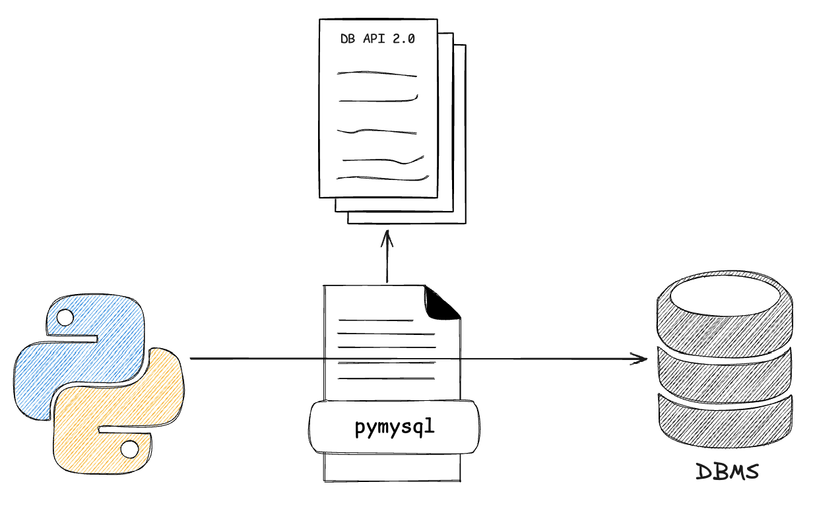

지난번에는 HTTP 통신으로 파이썬 app을 실행하기 위한 인터페이스인 wsgi(`web server gateway interface`)에 대해 알아보았고, 오늘은 DBMS를 python app으로 다루기 위한 표준 인터페이스인 Python DB API에 대해 알아보자.

# DB API (PEP 249)

[PEP249](https://peps.python.org/pep-0249/)에서는 Python에서 database에 접근하기 위한 인터페이스인 DB API 2.0을 제안하였다.

DB 서버(혹은 sqlite와 같은 DB file)가 있다고 했을 때, *클라이언트 어플리케이션으로서 Python 기반의 드라이버*를 사용하는데, 해당 드라이버가 지켜야하는 스펙이다. 우리는 인터페이스를 준수하는 드라이버(예를 들면 sqlite3, pymysql)를 사용함으로써 DBMS마다 다른 연결 및 쿼리 실행을 일관적인 인터페이스를 통해 사용할 수 있게 되었다.

다른 언어로 예시를 들면, Java의 `JDBC`(Java DataBase Connectivity)와 비슷한 역할을 하는 표준 API라고 보면 될 것 같다.!



## ORM과의 차이점

python DB API에는 **DBMS에 접근**하고, **SQL을 실행**하는 등의 기본적인 인터페이스가 정의되어있다. 주의할 점은 DBMS마다 다른 SQL의 실행과 결과를 Object로 추상화한 것은 ORM library의 영역이고, DB API에서는 더 기본적인 동작을 제안한다는 것이다.

`PEP 249`에서 제안하고 있는 DB API에는 크게 connection과 cursor 객체로 구성되어 있는데 간단히 알아보자.

## 주요 객체

### connection

SQL을 실행하기 위해 DBMS와 연결되어 있어야하는데, 이러한 **연결과 트랜잭션을 추상화**한 객체이다.

- connect : 연결하기 위한 메서드
- close : 연결을 종료하기 위한 메서드. 이후에는 쿼리 실행이 불가하다
- commit : 현재 트랜잭션을 커밋하기 위한 메서드
- rollback : 트랜잭션을 롤백하기 위한 메서드
- cursor : 연결에 해당하는 새로운 `Cursor` 객체를 반환하는 팩토리 메서드

커넥션 객체가 생성되었다고 해서, *물리적인 TCP Connection이 생겼다고는 말할 수 없을 것* 같다. sqlite와 같은 file 혹은 memory DB의 경우가 있으므로, **Connection 객체는 단순히 DB와 python을 이어주는 객체**라고 생각하는 게 더 낫다.

#### connection pooling

참고로, `connection pooling`은 DB API의 스펙은 아니고, DB driver 혹은 그 상위 레이어(application)에서 이를 제공하는 것으로 이해하면 될 것 같다.

### cursor

쿼리의 실행 결과를 담을 수 있는 객체이다. **DB 서버 내에서 쿼리 실행 결과를 저장해놓는 공간을 cursor로 추상화**하였다고 보면 될 것 같다.

- close : cursor를 종료하는 메서드
- execute : query를 **실행하는 메서드**. 파라미터 기반 실행으로 SQL injection을 방지할 수 있다.
- executemany : INSERT와 같이 여러 번의 실행을 한번에 보내는 메서드.
- fetchone : SELECT등의 쿼리 결과에서 한 행만 **DBMS로부터 가져오는 메서드**
- fetchmany : n개의 행을 가져오는 메서드
- fetchall : 쿼리 결과의 모든 행을 가져오는 메서드

일반적으로 `execute`가 호출되는 시점에 쿼리가 실행되고, 쿼리의 결과는 `fetch` 이전에는 DBMS의 버퍼 등에 저장되어 있다.  따라서, *fetch를 수행해야 결과를 memory로 가져올 수 있다*.

# 주요 구현체 (Drivers)

DB와 app을 server - client로 연결할 수 있게 도와주는 라이브러리/모듈을 보통 `DB Driver` 혹은 `connector` 라고 부른다. 개중에 우리가 사용하는 라이브러리들은 보통 `Python DB API 2.0`를 준수하도록 설계되어있다. (NoSQL 드라이버는 보통 준수하지 않음)

또한 라이브러리들은 python interface를 제공하지만 python으로 항상 구현되어 있지 않다는 점을 알고 있으면 좋을 것 같다. 대표적인 라이브러리들을 알아보자.

## SQLite3

https://docs.python.org/3/library/sqlite3.html

`sqlite` DB를 위한 `DB API 2.0`을 준수하는 db 드라이버이다. 내장 라이브러리이므로, 별도의 설치 없이 간편하게 실행해볼 수 있다.

REPL에서 실행해보자.

```python
❯ python
Python 3.11.4 (main, Sep 15 2024, 01:34:24) [Clang 15.0.0 (clang-1500.3.9.4)] on darwin
Type "help", "copyright", "credits" or "license" for more information.
>>> import sqlite3
>>> conn = sqlite3.connect("test.db") # file DB & connection 객체 생성됨
>>> conn.set_trace_callback(print) # query 디버깅을 위해 출력
>>> cursor = conn.cursor() # cursor 객체 생성
>>> cursor.execute('CREATE TABLE IF NOT EXISTS users (id INTEGER PRIMARY KEY, name TEXT)') # DB에 테이블 생성됨
```

connect를 통해 connection 객체를 만들어주고, connection 객체로부터 cursor를 만들어준다.

cursor 객체를 통해  query 문을 실행할 수 있는데, DDL의 경우 트랜잭션과는 독립적으로 바로 DB에 반영됨을 확인할 수 있다.

### 트랜잭션 다루기

DML을 실행해보며 트랜잭션을 다뤄보자.

connection이 트랜잭션의 단위임을 확인하기 위해 connection 객체를 2개 만들고, 각각 커서 객체를 2개씩 만들어 보았다.

```shell
>>> conn1 = sqlite3.connect("test.db")
>>> conn2 = sqlite3.connect("test.db")
>>> cur1_1 = conn1.cursor()
>>> cur1_2 = conn1.cursor()
>>> cur2_1 = conn1.cursor()
>>> cur2_1 = conn2.cursor()
>>> cur2_2 = conn2.cursor()
>>> conn1.set_trace_callback(print)
>>> conn2.set_trace_callback(print)
>>> cur1_1.execute(insert_query, 'bada1_1')
>>> insert_query = 'INSERT INTO users (name) VALUES (?)'
```

이제 insert_query를 실행해보자.

```shell
>>> cur1_1.execute(insert_query, ('bada1_1',)) # --- 1
BEGIN 
INSERT INTO users (name) VALUES ('bada1_1')
>>> cur1_2.execute(insert_query, ('bada1_2',)) # --- 2
INSERT INTO users (name) VALUES ('bada1_2')
>>> cur2_1.execute(insert_query, ('bada2_1',)) # --- 3
BEGIN 
INSERT INTO users (name) VALUES ('bada2_1')

Traceback (most recent call last):
  File "<stdin>", line 1, in <module>
sqlite3.OperationalError: database is locked
```

1. 1번 실행시, transaction이 열리고 (BEGIN) 쿼리가 실행된 것을 확인할 수 있다. 

   하지만 아직 DB에 반영되지 않고, `test.db-journal`이라는 sqlite에서 트랜잭션을 위한 파일이 생긴다.

2. 2번까지 실행했을 때에도 아직 DB에 반영되지 않은 상태이다.
3. 다른 커넥션에서 생성한 cursor에서 쿼리를 실행시, 오류가 발생한다. 이는 *SQLite에서 다른 트랜잭션이 닫히지 않았는데 쓰기 작업 시도시 발생*한다.

이로써 **트랜잭션의 단위는 cursor가 아닌 connection**임을 확인할 수 있다!

### 데이터 가져오기

이제 커밋도 하고, 데이터를 가져와보자.

```shell
>>> conn1.commit() # --- 1
COMMIT
>>> cur2_1.execute("SELECT * FROM users") # --- 2
SELECT * FROM users
>>> cur2_1.fetchall() # --- 3
[(1, 'bada1_1'), (2, 'bada1_2')]
```

1. commit을 하면 `test.db-journal`이라는 파일이 사라지고, file DB에 반영됨을 확인할 수 있다.
2. 2번 실행시, select query가 나간다. (타 DBMS에서는 쿼리만 실행되고 python app에서는 데이터가 없는 상태일 것이다)
3. 3번 실행시 cursor 객체를 통해 쿼리 결과를 튜플로 가져올 수 있다.


표준 라이브러리를 통해 DB API에서 정의한 connection과 cursor 객체를 어느정도 이해할 수 있었다. 다른 DBMS를 연결하기 위한 라이브러리도 간단하게 알아보자.

## pymysql

MySQL과 python을 연결해주는 `pymysql`이 있다. [github](https://github.com/PyMySQL/PyMySQL)

python 100%로 구현되어 있고, DB API를 준수하였음을 볼 수 있다.

## mysqlclient

또 다른 MySQL connector(driver)로 `mysqlclient`가 있다. [github](https://github.com/PyMySQL/mysqlclient) (보니까 pymysql과 같은 organization이다?!)

구 `mysql-connector-python`의 python3 호환 버전이라고 한다. 

c 기반의 라이브러리라서 성능은 pymysql보다 빠르지만, 시스템에 추가적인 의존성이 필요한 경우가 있다. 나도 mysqlclient는 가끔 동작하지 않는 경우 클린 재설치를 해주고 stackoverflow의 도움을 받은 경험이 많다;

따라서 로컬에서는 pymysql로 개발하고, 프로덕션 환경에서는 mysqlclient를 사용하는 것도 방법일 수 있겠다.

### SQLAlchemy와의 차이점

추가적으로, `SQLAlchemy`에 대해 헷갈릴 수 있어서 짚고 넘어가자. SQLAlchemy는 공식 설명에도 나와있듯, python을 위한 database toolkit이다. 주의할 점은 python db api의 구현체는 아니라는 점이다!


SQLAlchemy는 core와 ORM layer로 구성되어 있고, core의 engine은 DB API의 구현체인 드라이버들을 사용하여 DB와 연결하고 질의하도록 되어있다. SQLAlchemy를 사용하더라도 pymysql, mysqlclient와 같은 DB API 준수 driver를 추가로 설치해야하는 이유를 이제 설명할 수 있을 것이다.!


화이팅~

